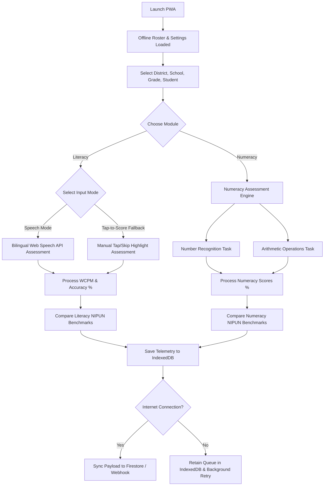

# Product Requirements Document (PRD)

**Product Name:** Neev FLN Assessor (Foundational Literacy & Numeracy PWA)  
**Document Status:** Draft  
**Version:** 1.1  
**Author:** Shashank Banerjee (MIS & Data Systems Architect)  

---

## 1. Executive Summary

### 1.1. Product Vision & Goals
The **Neev FLN Assessor** is an offline-first, hardware-adaptive Progressive Web Application (PWA) designed to automate, standardize, and scale student foundational learning assessments across government schools in India. 

Aligned with the national **NIPUN Bharat Mission** (National Initiative for Proficiency in Reading with Understanding and Numeracy), the application measures:
1. **Foundational Literacy:** Oral reading fluency (ORF) and reading comprehension for primary school students (Grades 1 to 3) in Hindi and English.
2. **Foundational Numeracy:** Number recognition and core arithmetic operations (addition, subtraction, multiplication, division) for Grades 1 to 3.

By replacing slow, paper-based surveys and subjective human-marked reports, this tool empowers block assessors, NGO program coordinators, and teachers to capture highly accurate student learning outcomes in real-time, even in zero-connectivity environments.

### 1.2. Problem Statement
1. **Paper-to-Digital Lag:** Current assessments require physical worksheets and scorecards. Manual transcription of these forms into district MIS systems takes weeks or months, delaying policy corrections.
2. **Subjective & Inconsistent Scoring:** Human testers evaluate reading speed and math errors subjectively, introducing bias and inconsistency across schools and districts.
3. **Low-Resource Environments:** Rural schools suffer from poor internet connectivity, high classroom noise levels, and are assessed using low-end, sub-$100 Android smartphones. Existing heavy apps fail under these hardware and connectivity constraints.

### 1.3. Solution Summary
A lightweight PWA built with vanilla web technologies, optimized to run on low-spec Android devices. It features:
* **Bilingual Speech Engine:** Utilizing local browser-native Speech Recognition (Web Speech API) supporting English and Hindi locales for Literacy.
* **Tap-to-Score Manual Fallback:** A simple tap interface enabling manual grading when background noise is high or speech-to-text is unavailable.
* **Foundational Numeracy Engine:** Visual assessment grids for number recognition and mathematical logic with simple grading toggles.
* **Offline-First Data Pipeline:** Automatic local storage caching (using IndexedDB) with a background syncing engine that posts compressed assessment payloads when network coverage is restored to Firebase Firestore or custom Webhooks.
* **Direct MIS Dashboard Pipeline:** Assessment data structured to flow seamlessly into centralized databases, feeding administrative dashboards (such as the PARAKH State Telemetry Dashboard) for rapid resource allocation.

---

## 2. Target Audience & User Personas

| Persona | Role | Technology Profile | Key Pain Points |
| :--- | :--- | :--- | :--- |
| **Ramesh Kumar** (Teacher/Assessor) | Class 3 Government Teacher | Uses a 4-year-old budget Android phone. Spotty 3G/4G coverage at school. | Class sizes of 40+ students. Spent hours writing reports. Finds complex apps confusing. |
| **Sunita Rao** (Block/District Inspector) | Block Resource Coordinator (BRC) | Moderately tech-savvy. Travels to 5 schools daily for inspections. | Subjective assessment results. Hard to track actual reading speed (WPM) manually with a stopwatch. |
| **State Education Secretary** (Administrator) | Policy Maker & Strategic Lead | High-end laptop/tablet. Relies on state-wide metrics for resource planning. | High data inflation rates in manual surveys; unable to track NIPUN implementation effectiveness in real time. |

---

## 3. Core Features & Functional Requirements



### 3.1. Roster and Selection Management
* **District/School Hierarchical Selector:** Simple cascading dropdowns populated from cached local database (District $\rightarrow$ Block $\rightarrow$ Cluster $\rightarrow$ School $\rightarrow$ Grade).
* **Module Selection:** The assessor toggles between **Literacy** (Hindi or English) and **Numeracy** assessment modules.
* **Student Roster Caching:** The app pre-downloads student lists (Name, Roll Number, ID) when online. Assessors select a student completely offline.
* **Passage & Math Question Provisioning:** Passages (for Literacy) and math problem banks (for Numeracy) are mapped to grade-specific difficulty levels.

### 3.2. Bilingual Speech Assessment Engine (Literacy)
* **Web Speech API Integration:** Native browser speech-to-text targeting `en-IN` (Indian English) and `hi-IN` (Indian Hindi).
* **Real-time Accent Adaptation:** Post-process speech-to-text transcripts using phoneme-matching algorithms or simple Levenshtein distance calculations to tolerate regional dialect variations.
* **Real-Time Text Highlighting:**
  * Words read correctly turn **Emerald Green** (with background alpha).
  * Mispronounced or skipped words are highlighted in **Coral Red** with a strikethrough.
* **Stopwatch Control:** Simple Start/Stop button. Auto-stops if silence is detected for more than 10 seconds.

### 3.3. Tap-to-Score (Manual Fallback Mode - Literacy)
* **Critical Context:** Classrooms in rural schools are loud, and speech recognition might be unsupported on older browser webviews.
* **Functionality:** 
  * Displays the target passage in a grid.
  * As the child reads, the assessor holds a stopwatch or follows the screen-guided timer.
  * The assessor taps any word the child mispronounces or skips.
  * Tapped words turn **Coral Red / Strikethrough** (indicating an error).
  * Double-tapping marks a word as "skipped" entirely.
  * Untapped words default to **Emerald Green** (correct) when the test is submitted.

### 3.4. Foundational Numeracy Assessment Engine
The Numeracy module evaluates core mathematical foundations divided into two sequential exercises:

#### 3.4.1. Number Recognition Task
* The screen displays 5 randomly selected numbers from the grade-level range:
  * **Grade 1:** Numbers 1 to 99.
  * **Grade 2:** Numbers 100 to 999.
  * **Grade 3:** Numbers 1000 to 9999.
* The assessor prompts the child to read each number aloud.
* The assessor taps a number on the screen to mark it as **Incorrect** (Coral Red highlight). Untapped numbers default to **Correct** (Emerald Green).

#### 3.4.2. Arithmetic Operations Task
* The screen displays 5 arithmetic questions based on grade level, presented one at a time:
  * **Grade 1:** Single-digit addition and subtraction (e.g. `5 + 3`, `8 - 2`).
  * **Grade 2:** Two-digit addition and subtraction without borrowing/carrying (e.g. `45 + 23`, `89 - 34`).
  * **Grade 3:** Three-digit addition/subtraction (with carrying/borrowing) and single-digit multiplication and division (e.g., `356 + 124`, `6 x 7`, `24 / 4`).
* The child states the answer orally or writes it on a slate.
* The assessor taps **Correct** (Checkmark button) or **Incorrect** (Cross button) on the screen to record the outcome.

### 3.5. Grading Engine & NIPUN Benchmarks
The grading engine automatically computes scores upon completion of the reading or math session:

#### 3.5.1. Foundational Literacy Metrics & Benchmarks
* **Calculations:**
  $$\text{Accuracy Rate (\%)} = \frac{\text{Words Read Correctly}}{\text{Total Words in Passage}} \times 100$$
  $$\text{Oral Reading Fluency (WCPM)} = \frac{\text{Words Read Correctly}}{\text{Duration of Reading (Seconds)}} \times 60$$
* **NIPUN Benchmarks:**
  * **Grade 1:** Reads small sentences containing at least 4–5 simple words with $\ge 80\%$ accuracy and answers a comprehension question correctly.
  * **Grade 2:** Reads with meaning at a minimum rate of **45–60 words per minute (WPM)**.
  * **Grade 3:** Reads with meaning at a minimum rate of **60 words per minute (WPM)**.

#### 3.5.2. Foundational Numeracy Metrics & Benchmarks
* **Calculations:**
  $$\text{Number Recognition Score (\%)} = \frac{\text{Numbers Recognized Correctly}}{\text{Total Numbers Tested (5)}} \times 100$$
  $$\text{Operations Score (\%)} = \frac{\text{Operations Solved Correctly}}{\text{Total Operations Tested (5)}} \times 100$$
* **NIPUN Benchmarks:**
  * **Grade 1:** Recognizes numbers up to 99 ($\ge 80\%$ accuracy) and solves at least 3 out of 5 single-digit addition/subtraction problems.
  * **Grade 2:** Recognizes numbers up to 999 ($\ge 80\%$ accuracy) and solves at least 3 out of 5 two-digit addition/subtraction problems.
  * **Grade 3:** Recognizes numbers up to 9999 ($\ge 80\%$ accuracy) and solves at least 3 out of 5 multiplication/division problems.

#### 3.5.3. Assessment Results Card
The interface displays a unified visual card showing:
1. **Accuracy / Success Rating** (Low / Moderate / Proficient)
2. **NIPUN Benchmark Met** (Yes/No)
3. **Primary Score** (WCPM for Literacy, Operations/Recognition percentage for Numeracy)

### 3.6. Administration, Onboarding & Security

#### 3.6.1. Secure Admin Console
* **Access:** Accessible via a master administrator passcode or menu shortcut from the Settings screen.
* **Functionality:** 
  * Controls application-wide parameters (cloud database credentials, offline sync modes).
  * Houses bulk data controls (import/export templates, purge cache).
  * Accesses the onboarding sub-panels (Assessor, School, and Student managers).

#### 3.6.2. Assessor Manager & Security Login
* **Assessor Creation:** Admins can manually create assessor profiles consisting of: Assessor Name, Username/ID, 4-digit Access PIN, and School Access List.
* **Assessor Login View:** When the app launches, if assessors are registered, a passcode/PIN lock screen overlays the UI. Assessors select their name from a list, enter their PIN, and log in. The logged-in `assessor_id` is automatically attached to all subsequent telemetry assessment JSON records.

#### 3.6.3. School Onboarding Panel
* **Purpose:** Allows manual onboarding of new schools when offline, bypassing the pre-packaged roster databases.
* **Fields:** School Name, UDISE Code (unique key), Cluster, Block, District.
* **Database:** Saves directly to the local IndexedDB `schools` database.

#### 3.6.4. Student Onboarding Panel
* **Purpose:** Enables assessors or coordinators to register new students in the classroom on the fly.
* **Fields:** Student Name, Roll Number, Class/Grade (1, 2, or 3), Age, Gender, School Selection (dropdown populated from the local `schools` store).
* **Database:** Saves to the local IndexedDB `students` database, assigning a temporary unique ID (e.g. `STUD-TEMP-uuid`) so they can be immediately evaluated.

---

## 4. Technical Architecture & Offline Pipeline

### 4.1. Vanilla Frontend Stack
To run reliably on sub-$100 mobile devices, the app must not depend on bloated JS bundlers.
* **Frontend:** Clean Semantic HTML5 and modular, utility-free Vanilla CSS.
* **Core Logic:** Vanilla Javascript.
* **Database:** IndexedDB (via a lightweight wrapper like localForage) to manage student lists, passage files, and pending sync queues.

### 4.2. Synchronization Engine (Offline-First)
* **Storage Protocol:** When a test is completed, the payload is immediately serialized as a JSON string and saved into the local IndexedDB database.
* **Background Worker:** A Service Worker monitors the network state (`navigator.onLine`).
* **Conflict-Free Syncing:**
  1. Once internet is detected, the worker reads all unsynced assessment rows.
  2. Telemetry payload is transmitted via a compressed POST endpoint.
  3. Upon receiving a server `200 OK`, the local record is marked `synced = true` or pruned from the queue.

---

## 5. Analytics Data Schema

To ensure seamless integration with downstream enterprise data warehouses (like Shashank's custom Star/Galaxy Schema built for state dashboarding), every assessment event writes a normalized payload structured for ETL processes.

### 5.1. Assessment Telemetry Payload (JSON)
```json
{
  "assessment_id": "uuid-v4-9b1deb4d-3b7d-4bad",
  "assessor_id": "BRC-KANPUR-402",
  "student_id": "STUD-2026-99120",
  "metadata": {
    "district": "Kanpur Nagar",
    "block": "Kalyanpur",
    "school_udise": "09330104102",
    "grade_level": 3,
    "language": "hi"
  },
  "passage_id": "passage-grade3-hi-02",
  "session": {
    "timestamp_start": "2026-07-18T09:30:00Z",
    "duration_seconds": 45,
    "input_mode": "voice",
    "background_noise_estimate_db": 42
  },
  "metrics": {
    "total_words_in_passage": 52,
    "words_attempted": 48,
    "words_correct": 42,
    "wcpm": 56,
    "accuracy_percentage": 87.5,
    "nipun_target_achieved": false
  },
  "word_telemetry": [
    {"word_index": 0, "word": "एक", "status": "correct", "duration_ms": 320},
    {"word_index": 1, "word": "तेज़", "status": "correct", "duration_ms": 280},
    {"word_index": 2, "word": "भूरी", "status": "incorrect", "duration_ms": 610},
    {"word_index": 3, "word": "लोमड़ी", "status": "skipped", "duration_ms": 0}
  ],
  "synced": false
}
```

---

## 6. Non-Functional Requirements (NFRs)

### 6.1. Device and Browser Support
* **Operating System:** Optimized for Android 8.0 (Oreo) and above.
* **Browser Compatibility:** Chrome for Android (version 80+), which includes built-in, hardware-accelerated speech synthesizers and recognition profiles for regional Indian languages.
* **App Weight:** Total PWA size (including service workers, core design system, icons, and 5 standard assessment passages per grade) must remain under **1.8 MB** for fast download over poor mobile networks.

### 6.2. Security and Data Privacy (DPDP Act Compliance)
* **No Voice Recording Storage:** To comply with India's **Digital Personal Data Protection (DPDP) Act 2023**, the application *must not* record, store, or transmit the child's raw audio files. The Web Speech API performs speech-to-text processing on-device, and only the text match data is retained.
* **Data Sanitization:** Student rosters use school registry IDs rather than storing highly sensitive personal identifiers (like Aadhaar card numbers) on the device's local database.

---

## 7. Success Metrics & KPIs
1. **Offline Sync Completion Rate:** $\ge 99.8\%$ of offline assessments successfully synchronized to state servers within 24 hours of reconnecting.
2. **Assessment Time Saved:** Reduction in time required to complete and digitize a single class assessment from 5 days (manual collection + data entry) to **under 2 minutes** per child.
3. **Fallback Utilization Rate:** Tracking the percentage of tests done in Tap-to-Score mode vs Speech Recognition mode to measure device compatibility and classroom noise thresholds.
